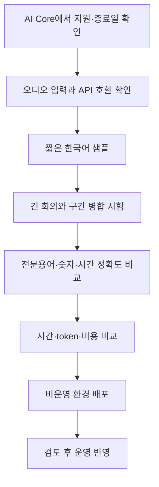

# 5-6. AI 모델 변경을 코드와 운영 관점에서 이해하기

## 이 프로젝트에는 AI 모델 자리가 두 곳 이상 있다

“모델을 바꾼다”는 말을 하기 전에 어떤 작업의 모델인지 구분해야 한다.

| 작업 | 실행 위치 | 현재 코드·배포 설정의 기준 |
|---|---|---|
| 음성 전사 | Python Worker | `AICORE_STT_MODEL` |
| 회의 요약 | CAP AI Core Orchestration | summary template 또는 관련 설정 |
| 검토 후보 | CAP direct orchestration | `CAP_LLM_MODEL` |

하나를 바꿔도 나머지가 자동으로 바뀌지 않는다.

## 코드에서 확인되는 현재 값

현재 `mta.yaml`에는 다음 값이 들어 있다.

- STT: `gemini-2.5-flash`
- 검토 direct 모델: `anthropic--claude-4.7-opus`
- 요약: `meeting-whisper-summary-ko-v1`이라는 AI Core template 참조

요약 template가 내부에서 실제 어떤 모델 버전을 선택하는지는 저장소의 문자열만으로 확정할 수 없다. AI Core의 해당 configuration을 확인해야 한다.

## 모델명만 바꾸면 끝나지 않는 이유

음성 전사 모델을 교체할 때는 다음을 확인해야 한다.

- 오디오 입력을 지원하는가
- 현재 Orchestration 요청 형식과 호환되는가
- JSON 지시를 안정적으로 따르는가
- 한국어와 전문용어 품질은 어떤가
- 긴 음원의 시간 정보가 안정적인가
- 요청 크기, timeout과 rate limit은 어떤가
- token 환산과 비용은 어떻게 달라지는가
- SAP AI Core의 대상 resource group에서 실제 배포 가능한가

## 지원 여부를 확인하는 공식 기준

모델 지원과 종료일은 빠르게 바뀐다. 동료 원본 문서의 특정 종료일과 추천 후보를 영구 사실로 외우면 안 된다.

SAP 공식 문서는 다음 두 방법을 안내한다.

1. SAP Note 3437766에서 지원 모델과 deprecation 정보를 확인
2. 현재 AI Core 환경의 Model Discovery endpoint에서 버전별 `deprecated`, `retirementDate`, `inputTypes`와 비용 정보를 조회

공식 안내: [SAP AI Core Supported Models](https://help.sap.com/docs/sap-ai-core/generative-ai/supported-models)

2026-07-29 기준 SAP의 What's New에는 Gemini 3.5 Flash와 3.1 Flash Lite 같은 새로운 지원 공지가 보이지만, 이것만으로 현재 프로젝트의 오디오 전사 대체 모델을 결정할 수는 없다. 실제 환경에서 오디오 capability와 요청 호환성을 확인해야 한다.

## 모델 교체 검증 순서

## 모델 변경과 MTA

현재 STT 모델명은 `mta.yaml`의 Worker 환경 변수에 있으므로 값을 바꾸면 새 MTAR를 빌드·배포하는 변경이 된다.

환경에서만 임시로 값을 바꾸면 다음 배포 때 `mta.yaml` 값으로 돌아갈 수 있다. 운영 기준을 코드에 남길지 외부 환경 설정으로 분리할지 팀 정책이 필요하다.

## 품질 비교 기준

단순히 “전사문이 자연스럽다”만 보면 안 된다.

- 실제 발언을 추가하거나 생략하지 않는가
- 고유명사와 숫자가 맞는가
- 발언 시간 순서가 맞는가
- 긴 회의 구간 경계에서 중복·누락이 없는가
- 같은 음원에서 결과 변동이 큰가
- 후처리 검수 후보가 얼마나 발생하는가

## 핵심 정리

> AI 모델 교체는 문자열 변경이 아니라 지원 상태 확인, 오디오 capability, 품질·시간·비용 비교와 비운영 검증을 거치는 운영 변경이다.

처음으로: [[팀 동료 요약 내용/세부 분석/README|초보자용 세부 분석 목차]]
